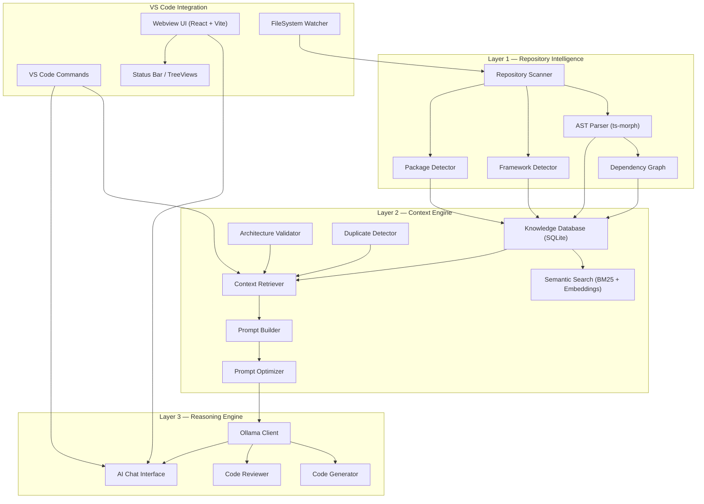
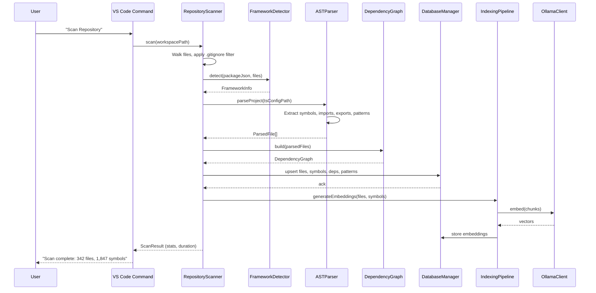
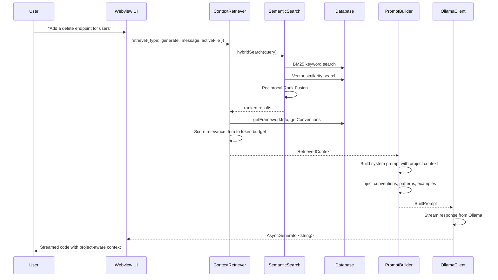

# Repository Intelligence Engine — Implementation Plan

## Vision

A VS Code extension that **deeply understands** a software project before interacting with any AI model. The AI never receives the entire repository — instead, the engine analyzes, indexes, and retrieves only the relevant context to generate optimized prompts for local Ollama models.

---

## Three-Layer Architecture



---

## Technology Decisions

| Concern | Choice | Rationale |
|---|---|---|
| **Language** | TypeScript (strict) | Type safety, VS Code native |
| **AST Analysis** | `ts-morph` | Full type-checker access, symbol resolution, import tracing |
| **Fast Parse** | `web-tree-sitter` (WASM) | Incremental parsing on keystroke, no native bindings |
| **Database** | `sql.js` (WASM SQLite) | Zero native deps, runs in any Electron version, no rebuild needed |
| **Embeddings** | Ollama `nomic-embed-text` | Runs locally via same Ollama server, no extra infra |
| **Keyword Search** | Custom BM25 in TypeScript | Lightweight, no external dep |
| **Bundler** | esbuild | Fast, VS Code standard |
| **Webview UI** | React 18 + Vite | HMR in dev, fast production builds |
| **LLM Client** | `ollama` npm package | Official SDK, streaming support |
| **File Watching** | VS Code `FileSystemWatcher` | Native API, no polling |

> [!IMPORTANT]
> **Why `sql.js` over `better-sqlite3`?** Native Node modules cause ABI mismatch errors across Electron versions. `sql.js` compiles SQLite to WASM — zero platform issues, zero `node-gyp` headaches.

> [!IMPORTANT]
> **Why Ollama for embeddings too?** Ollama supports `nomic-embed-text` natively. One dependency for both LLM and embeddings keeps the offline story clean. No need for Transformers.js in MVP.

---

## Folder Structure

```
repoanalyser/
├── .vscode/
│   ├── launch.json              # Extension debug configs
│   └── settings.json
├── src/
│   ├── extension.ts             # Activation entry point (lean)
│   ├── container.ts             # Dependency injection / service locator
│   │
│   ├── layer1-intelligence/     # Layer 1: Repository Intelligence
│   │   ├── scanner/
│   │   │   ├── RepositoryScanner.ts
│   │   │   ├── FileClassifier.ts
│   │   │   └── GitIgnoreFilter.ts
│   │   ├── framework/
│   │   │   ├── FrameworkDetector.ts
│   │   │   ├── detectors/
│   │   │   │   ├── ReactDetector.ts
│   │   │   │   ├── NextjsDetector.ts
│   │   │   │   ├── NestjsDetector.ts
│   │   │   │   ├── NodeDetector.ts
│   │   │   │   └── ExpressDetector.ts
│   │   │   └── types.ts
│   │   ├── packages/
│   │   │   ├── PackageDetector.ts
│   │   │   └── DependencyAnalyzer.ts
│   │   ├── ast/
│   │   │   ├── ASTParser.ts
│   │   │   ├── SymbolExtractor.ts
│   │   │   ├── ImportResolver.ts
│   │   │   └── PatternDetector.ts
│   │   └── graph/
│   │       ├── DependencyGraph.ts
│   │       └── GraphAnalyzer.ts
│   │
│   ├── layer2-context/          # Layer 2: Context Engine
│   │   ├── database/
│   │   │   ├── DatabaseManager.ts
│   │   │   ├── migrations/
│   │   │   │   └── 001_initial.ts
│   │   │   └── repositories/
│   │   │       ├── FileRepository.ts
│   │   │       ├── SymbolRepository.ts
│   │   │       ├── DependencyRepository.ts
│   │   │       └── EmbeddingRepository.ts
│   │   ├── search/
│   │   │   ├── SemanticSearch.ts
│   │   │   ├── BM25Engine.ts
│   │   │   ├── VectorSearch.ts
│   │   │   └── HybridRanker.ts
│   │   ├── retrieval/
│   │   │   ├── ContextRetriever.ts
│   │   │   ├── RelevanceScorer.ts
│   │   │   └── ContextWindow.ts
│   │   ├── prompt/
│   │   │   ├── PromptBuilder.ts
│   │   │   ├── PromptOptimizer.ts
│   │   │   └── templates/
│   │   │       ├── codeGeneration.ts
│   │   │       ├── codeReview.ts
│   │   │       ├── chat.ts
│   │   │       └── architecture.ts
│   │   ├── validation/
│   │   │   ├── ArchitectureValidator.ts
│   │   │   └── DuplicateDetector.ts
│   │   └── indexer/
│   │       ├── IndexingPipeline.ts
│   │       └── EmbeddingGenerator.ts
│   │
│   ├── layer3-reasoning/        # Layer 3: Reasoning Engine
│   │   ├── ollama/
│   │   │   ├── OllamaClient.ts
│   │   │   ├── OllamaHealthCheck.ts
│   │   │   └── ModelManager.ts
│   │   ├── generation/
│   │   │   ├── CodeGenerator.ts
│   │   │   └── CodeReviewer.ts
│   │   └── chat/
│   │       ├── ChatSession.ts
│   │       └── ChatHistory.ts
│   │
│   ├── shared/                  # Cross-cutting concerns
│   │   ├── types/
│   │   │   ├── index.ts
│   │   │   ├── scanner.types.ts
│   │   │   ├── ast.types.ts
│   │   │   ├── database.types.ts
│   │   │   ├── context.types.ts
│   │   │   ├── prompt.types.ts
│   │   │   └── ollama.types.ts
│   │   ├── constants.ts
│   │   ├── errors.ts
│   │   ├── Logger.ts
│   │   ├── EventBus.ts
│   │   └── utils/
│   │       ├── fileUtils.ts
│   │       ├── hashUtils.ts
│   │       └── tokenCounter.ts
│   │
│   └── vscode/                  # VS Code integration layer
│       ├── commands/
│       │   ├── registerCommands.ts
│       │   ├── scanRepository.ts
│       │   ├── openChat.ts
│       │   ├── generateCode.ts
│       │   └── reviewCode.ts
│       ├── providers/
│       │   ├── ChatViewProvider.ts
│       │   ├── KnowledgeTreeProvider.ts
│       │   └── StatusBarManager.ts
│       └── watchers/
│           └── FileWatcherManager.ts
│
├── webview-ui/                  # Separate Vite+React app
│   ├── index.html
│   ├── vite.config.ts
│   ├── tsconfig.json
│   ├── src/
│   │   ├── main.tsx
│   │   ├── App.tsx
│   │   ├── vscode.ts           # acquireVsCodeApi wrapper
│   │   ├── components/
│   │   │   ├── Chat/
│   │   │   ├── Knowledge/
│   │   │   └── Settings/
│   │   ├── hooks/
│   │   ├── stores/
│   │   └── styles/
│   └── package.json
│
├── test/
│   ├── unit/
│   ├── integration/
│   └── fixtures/
│
├── package.json                 # Extension manifest
├── tsconfig.json
├── esbuild.js                   # Build script
├── .vscodeignore
└── README.md
```

---

## Core Interfaces

```typescript
// ═══════════════════════════════════════
// Layer 1 — Repository Intelligence
// ═══════════════════════════════════════

interface IRepositoryScanner {
  scan(workspacePath: string): Promise<ScanResult>;
  rescanFile(filePath: string): Promise<void>;
}

interface ScanResult {
  files: ScannedFile[];
  framework: FrameworkInfo;
  packages: PackageInfo;
  duration: number;
}

interface ScannedFile {
  path: string;
  relativePath: string;
  language: Language;
  category: FileCategory;
  hash: string;
  size: number;
  lastModified: number;
}

type FileCategory =
  | 'component' | 'page' | 'layout'
  | 'hook' | 'context' | 'service'
  | 'api-route' | 'controller' | 'middleware'
  | 'utility' | 'helper' | 'lib'
  | 'type' | 'interface' | 'enum' | 'constant'
  | 'config' | 'test' | 'style'
  | 'store' | 'reducer' | 'action'
  | 'model' | 'schema' | 'migration'
  | 'guard' | 'pipe' | 'interceptor' | 'decorator'
  | 'unknown';

interface FrameworkInfo {
  primary: Framework;
  secondary: Framework[];
  version: string;
  router: 'app-router' | 'pages-router' | 'react-router' | 'nest-router' | 'unknown';
  stateManagement: string[];
  styling: string[];
  testing: string[];
  orm: string | null;
}

type Framework = 'react' | 'nextjs' | 'nestjs' | 'express' | 'node' | 'unknown';

// ═══════════════════════════════════════
// AST & Dependency Graph
// ═══════════════════════════════════════

interface IASTParser {
  parseFile(filePath: string): Promise<ParsedFile>;
  parseProject(tsConfigPath: string): Promise<ParsedFile[]>;
}

interface ParsedFile {
  path: string;
  symbols: SymbolInfo[];
  imports: ImportInfo[];
  exports: ExportInfo[];
  patterns: DetectedPattern[];
}

interface SymbolInfo {
  name: string;
  kind: SymbolKind;
  signature: string;
  documentation: string;
  location: LocationRange;
  complexity: number;
  dependencies: string[];
}

type SymbolKind =
  | 'function' | 'class' | 'interface' | 'type'
  | 'enum' | 'variable' | 'constant' | 'hook'
  | 'component' | 'decorator' | 'method' | 'property';

interface ImportInfo {
  source: string;
  resolvedPath: string | null;
  specifiers: string[];
  isTypeOnly: boolean;
  isExternal: boolean;
}

interface IDependencyGraph {
  build(parsedFiles: ParsedFile[]): void;
  getDependencies(filePath: string): string[];
  getDependents(filePath: string): string[];
  getTransitiveDeps(filePath: string, depth?: number): string[];
  getAffectedFiles(changedFiles: string[]): string[];
  getClusters(): FileCluster[];
}

// ═══════════════════════════════════════
// Layer 2 — Context Engine
// ═══════════════════════════════════════

interface IContextRetriever {
  retrieve(query: ContextQuery): Promise<RetrievedContext>;
}

interface ContextQuery {
  type: 'chat' | 'generate' | 'review' | 'refactor';
  userMessage: string;
  activeFile?: string;
  selectedCode?: string;
  maxTokens: number;
}

interface RetrievedContext {
  files: ContextFile[];
  symbols: SymbolInfo[];
  framework: FrameworkInfo;
  conventions: ProjectConvention[];
  dependencies: DependencyInfo[];
  totalTokens: number;
}

interface ContextFile {
  path: string;
  content: string;
  relevanceScore: number;
  reason: string; // why this file was included
}

interface IPromptBuilder {
  build(context: RetrievedContext, query: ContextQuery): BuiltPrompt;
}

interface BuiltPrompt {
  system: string;
  messages: ChatMessage[];
  estimatedTokens: number;
  contextSummary: string;
}

// ═══════════════════════════════════════
// Layer 3 — Reasoning Engine
// ═══════════════════════════════════════

interface IOllamaClient {
  chat(prompt: BuiltPrompt, options?: OllamaOptions): AsyncGenerator<string>;
  embed(texts: string[]): Promise<number[][]>;
  listModels(): Promise<ModelInfo[]>;
  healthCheck(): Promise<boolean>;
}

interface OllamaOptions {
  model: string;
  temperature: number;
  maxTokens: number;
  stream: boolean;
}
```

---

## Database Schema (SQLite via sql.js)

```sql
-- ═══════════════════════════════════════
-- Core Tables
-- ═══════════════════════════════════════

CREATE TABLE projects (
  id          TEXT PRIMARY KEY,
  name        TEXT NOT NULL,
  root_path   TEXT NOT NULL UNIQUE,
  framework   TEXT NOT NULL DEFAULT 'unknown',
  metadata    TEXT, -- JSON blob
  created_at  INTEGER NOT NULL,
  updated_at  INTEGER NOT NULL,
  last_scan   INTEGER
);

CREATE TABLE files (
  id            TEXT PRIMARY KEY,
  project_id    TEXT NOT NULL REFERENCES projects(id),
  path          TEXT NOT NULL,
  relative_path TEXT NOT NULL,
  language      TEXT NOT NULL,
  category      TEXT NOT NULL,
  content_hash  TEXT NOT NULL,
  size          INTEGER NOT NULL,
  last_modified INTEGER NOT NULL,
  last_indexed  INTEGER,
  UNIQUE(project_id, path)
);

CREATE TABLE symbols (
  id              TEXT PRIMARY KEY,
  file_id         TEXT NOT NULL REFERENCES files(id) ON DELETE CASCADE,
  name            TEXT NOT NULL,
  kind            TEXT NOT NULL,
  signature       TEXT,
  documentation   TEXT,
  start_line      INTEGER NOT NULL,
  end_line        INTEGER NOT NULL,
  start_col       INTEGER,
  end_col         INTEGER,
  complexity      INTEGER DEFAULT 0,
  metadata        TEXT -- JSON: params, return type, decorators
);

CREATE TABLE dependencies (
  id              TEXT PRIMARY KEY,
  source_file_id  TEXT NOT NULL REFERENCES files(id) ON DELETE CASCADE,
  target_file_id  TEXT REFERENCES files(id) ON DELETE SET NULL,
  source_symbol   TEXT,
  target_symbol   TEXT,
  dep_type        TEXT NOT NULL, -- 'import', 'type-import', 'dynamic', 're-export'
  is_external     INTEGER NOT NULL DEFAULT 0,
  module_name     TEXT -- for external deps
);

CREATE TABLE embeddings (
  id          TEXT PRIMARY KEY,
  file_id     TEXT REFERENCES files(id) ON DELETE CASCADE,
  symbol_id   TEXT REFERENCES symbols(id) ON DELETE CASCADE,
  chunk_text  TEXT NOT NULL,
  chunk_type  TEXT NOT NULL, -- 'file-summary', 'function', 'class', 'comment'
  vector      BLOB NOT NULL, -- float32 array serialized
  created_at  INTEGER NOT NULL
);

CREATE TABLE patterns (
  id          TEXT PRIMARY KEY,
  project_id  TEXT NOT NULL REFERENCES projects(id),
  pattern     TEXT NOT NULL, -- 'singleton', 'factory', 'observer', 'hoc', etc.
  file_id     TEXT REFERENCES files(id) ON DELETE CASCADE,
  symbol_name TEXT,
  confidence  REAL NOT NULL,
  metadata    TEXT
);

CREATE TABLE conventions (
  id          TEXT PRIMARY KEY,
  project_id  TEXT NOT NULL REFERENCES projects(id),
  category    TEXT NOT NULL, -- 'naming', 'structure', 'imports', 'exports'
  rule        TEXT NOT NULL,
  examples    TEXT, -- JSON array
  confidence  REAL NOT NULL
);

-- ═══════════════════════════════════════
-- Chat History
-- ═══════════════════════════════════════

CREATE TABLE chat_sessions (
  id          TEXT PRIMARY KEY,
  project_id  TEXT NOT NULL REFERENCES projects(id),
  title       TEXT,
  created_at  INTEGER NOT NULL,
  updated_at  INTEGER NOT NULL
);

CREATE TABLE chat_messages (
  id          TEXT PRIMARY KEY,
  session_id  TEXT NOT NULL REFERENCES chat_sessions(id) ON DELETE CASCADE,
  role        TEXT NOT NULL, -- 'user', 'assistant', 'system'
  content     TEXT NOT NULL,
  context_summary TEXT, -- what context was sent
  model       TEXT,
  tokens_used INTEGER,
  created_at  INTEGER NOT NULL
);

-- ═══════════════════════════════════════
-- Indexes
-- ═══════════════════════════════════════

CREATE INDEX idx_files_project ON files(project_id);
CREATE INDEX idx_files_category ON files(category);
CREATE INDEX idx_files_hash ON files(content_hash);
CREATE INDEX idx_symbols_file ON symbols(file_id);
CREATE INDEX idx_symbols_kind ON symbols(kind);
CREATE INDEX idx_symbols_name ON symbols(name);
CREATE INDEX idx_deps_source ON dependencies(source_file_id);
CREATE INDEX idx_deps_target ON dependencies(target_file_id);
CREATE INDEX idx_embeddings_file ON embeddings(file_id);
CREATE INDEX idx_embeddings_symbol ON embeddings(symbol_id);
CREATE INDEX idx_patterns_project ON patterns(project_id);
```

---

## Data Flow

### Full Repository Scan



### Context-Aware Chat



---

## Design Patterns

| Pattern | Where | Why |
|---|---|---|
| **Repository Pattern** | `database/repositories/` | Decouple data access from business logic |
| **Strategy Pattern** | `framework/detectors/` | Pluggable framework detection per framework |
| **Pipeline Pattern** | `IndexingPipeline` | Composable scan → parse → embed → store stages |
| **Observer / EventBus** | `shared/EventBus.ts` | Decouple file changes from re-indexing |
| **Builder Pattern** | `PromptBuilder` | Step-by-step prompt construction with token budgets |
| **Service Locator** | `container.ts` | Lazy initialization, testable dependency wiring |
| **Adapter Pattern** | `OllamaClient` | Abstract LLM interface; swap providers later |
| **Template Method** | Prompt templates | Shared prompt structure, variant-specific sections |

---

## Phased Build Plan

### Phase 1 — Foundation (Week 1-2)

Scaffold the extension, build the database layer, implement the repository scanner and framework detector.

**Deliverables:**
- [ ] VS Code extension scaffold with esbuild
- [ ] `sql.js` database integration with migrations
- [ ] Repository scanner (file walking, .gitignore, classification)
- [ ] Framework detector (React, Next.js, NestJS, Express, Node)
- [ ] Package detector (parse package.json, lock files)
- [ ] Basic status bar showing scan progress
- [ ] Extension settings (Ollama URL, model preferences)
- [ ] Logger and EventBus infrastructure

### Phase 2 — AST & Knowledge Graph (Week 3-4)

Deep code analysis with ts-morph, dependency graph construction, pattern detection.

**Deliverables:**
- [ ] ts-morph AST parser (symbols, imports, exports)
- [ ] Symbol extraction (functions, classes, hooks, components, types)
- [ ] Import resolver (internal vs external, re-exports)
- [ ] Dependency graph builder
- [ ] Pattern detector (HOC, hooks, decorators, factories, singletons)
- [ ] Convention detector (naming, file structure, export patterns)
- [ ] FileSystem watcher for incremental re-indexing
- [ ] Knowledge tree view in VS Code sidebar

### Phase 3 — Context Engine & Search (Week 5-6)

Semantic search, context retrieval, prompt building with token-aware optimization.

**Deliverables:**
- [ ] Ollama client with streaming + health check
- [ ] Embedding generation via `nomic-embed-text`
- [ ] BM25 keyword search engine
- [ ] Vector similarity search (cosine distance on BLOB vectors)
- [ ] Hybrid ranker (Reciprocal Rank Fusion)
- [ ] Context retriever with token budget management
- [ ] Prompt builder with framework-aware templates
- [ ] Prompt optimizer (deduplication, compression, prioritization)
- [ ] Architecture validator
- [ ] Duplicate detector

### Phase 4 — AI Integration & UI (Week 7-8)

Chat interface, code generation, code review, webview UI.

**Deliverables:**
- [ ] React + Vite webview scaffold
- [ ] Chat UI with streaming responses
- [ ] Code generation command (context-aware)
- [ ] Code review command (selected code or file)
- [ ] Chat history persistence
- [ ] Model selector (list available Ollama models)
- [ ] Settings panel in webview
- [ ] Knowledge explorer panel
- [ ] Copy/apply generated code actions

---

## Performance Considerations

1. **Lazy Activation** — Use `onCommand` / `onLanguage` activation events; never `*`
2. **Incremental Indexing** — FileSystemWatcher triggers re-parse of only changed files
3. **Worker Offloading** — Run AST parsing in a child process to avoid blocking the extension host
4. **Token Budget** — Context retriever enforces a hard token limit (default 4096); never send more than the model can handle
5. **Embedding Batching** — Batch embed requests (32 chunks/call) to minimize Ollama round-trips
6. **Content Hashing** — Skip re-indexing files whose SHA-256 hasn't changed
7. **Database WAL Mode** — Enable SQLite WAL for concurrent reads during indexing
8. **Debounced Watching** — 500ms debounce on file change events to avoid thrashing

## Scalability Considerations

1. **Plugin Architecture for Detectors** — New framework detectors implement `IFrameworkDetector` and register via the strategy map
2. **Provider Abstraction** — `IOllamaClient` can be swapped for `ICloudProvider` (OpenAI, Claude, Gemini) without touching the context engine
3. **Multi-language Support** — AST parser abstracted behind `IASTParser`; add Python/Go parsers in future phases
4. **Workspace Support** — Multi-root workspace handling via separate `Project` records in SQLite
5. **Monorepo Awareness** — Scanner detects `workspaces` in package.json and treats sub-packages as linked projects

## Future Improvements

1. **Cloud Provider Support** — OpenAI, Claude, Gemini behind the same `IReasoningProvider` interface
2. **RAG Pipeline** — Full retrieval-augmented generation with re-ranking and citation
3. **Architecture Diagrams** — Generate Mermaid/D2 diagrams from the dependency graph
4. **Refactoring Suggestions** — Detect code smells using pattern analysis + AI
5. **Team Conventions** — Shareable `.repo-intelligence.json` config for team-wide rules
6. **Multi-language Parsers** — Python (tree-sitter), Go, Java, C#, Rust
7. **Marketplace Publishing** — VSIX packaging, CI/CD, telemetry (opt-in)
8. **MCP Server** — Expose repository intelligence as an MCP server for external AI tools

---

## Open Questions

> [!IMPORTANT]
> **Model Selection**: Which Ollama models do you want as defaults? Recommended:
> - **Chat/Code Gen**: `deepseek-coder-v2:16b` or `codellama:13b`
> - **Embeddings**: `nomic-embed-text`
> - Should we allow users to select any installed model?

> [!IMPORTANT]
> **Extension Name**: "Repository Intelligence Engine" is the working title. What should the VS Code marketplace name be? Options:
> - `repo-intelligence`
> - `repoanalyser`
> - Something else?

> [!IMPORTANT]
> **Webview Placement**: Should the chat UI be:
> - A **sidebar panel** (like GitHub Copilot Chat)?
> - A **full editor tab** (like a document)?
> - **Both** (sidebar for quick chat, tab for deep sessions)?

> [!IMPORTANT]
> **Scope of MVP**: The plan above is ~8 weeks. Would you prefer to cut Phase 4 UI to a minimal terminal-style chat and ship faster, or invest in the full React webview from day one?

---

## Verification Plan

### Automated Tests
- Unit tests for each detector, parser, and retriever using Vitest
- Integration tests with fixture TypeScript projects (React app, NestJS app, Node API)
- Database migration tests
- Prompt builder output validation (token count, structure)

### Manual Verification
- Install extension in VS Code Extension Development Host
- Scan a real Next.js project and verify file classification accuracy
- Scan a real NestJS project and verify decorator/pattern detection
- Chat with context and verify relevant files are retrieved
- Generate code and verify it follows project conventions
- Verify Ollama health check and model listing
